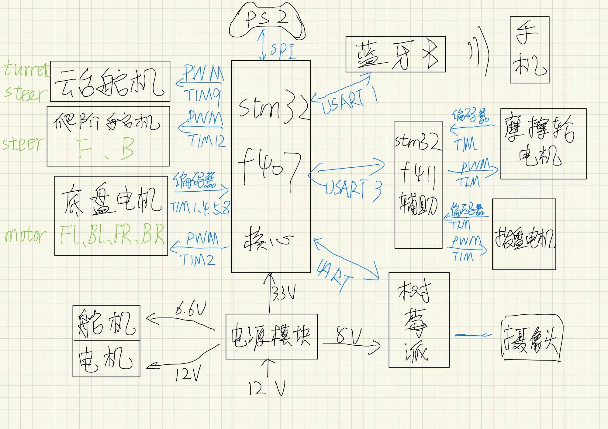

# My stm32 tank

#### 介绍
华南理工大学2022年无限机甲杯比赛中碱基互补配队的电控代码工程

作者：碱基互补配队电控组成员：林瑞创，江浩炯

#### 整体架构

##### 硬件

双MCU控制，stm32f407vet6作底盘主控，stm32f411ceu6作炮台主控

底盘是四驱小车，支持麦轮及普通橡胶轮，四个带编码器的减速电机，前后两个舵机爬台阶结构

炮台目前一自由度，一个舵机控制俯仰角，一个带编码器的蜗杆电机控制弹舱拨盘，两个555电机驱动摩擦轮。

支持ps2手柄和蓝牙上位机远程遥控

##### 软件

基于stm32 HAL库，stm32cubemx + keil5，面向对象思想模块化编写

#### 具体实现

##### cubemx配置

